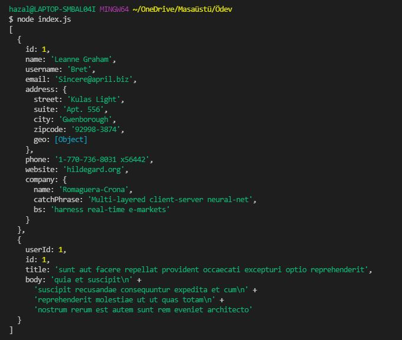

# Patika-React
Bu çalışmada promise yapısını kullanarak users ve post adlı iki fonksiyon tanımladım, fonksiyonlara number veri tipindeki id parametresini verdim, 
fonksiyonların görevi ise axios kütüphanesini kullanarak ilgili endpointe gitmek ve id parametresi ile ilgili kullanıcının verilerini çekmektir. İşlem sonucunda 
aşağıdaki gibi bir obje elde edilmiştir.

